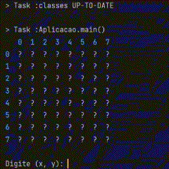

# Campo Minado
Aplicação de estudo desenvolvida seguindo a orientação do Prof. Leonardo Moura Leitão.

## 💻 Tecnologias utilizadas:
* ☕️ JAVA 17
* 🐘 Gradle
* 🧪JUnit

## 🛠️ Neste projeto coloquei em prática:
* POO
* Desacoplamento
* Refatoração de código
* Tratamento de exceções
* Testes unitários com Junit
* Gerenciamento do projeto com Gradle
* Introdução de conceitos funcionais em POO
* Criar exceções para alterar o controle do código

## 💣 Sobre o projeto
Primeiro projeto do curso de Java Completo da Cod3r. Foi desenvolvido o clássico jogo campo minado para ser jogado via linha de comando.

# 👀 Observações
* Ganha-se marcando todos os campos que contem minas.
* Você pode alterar o tamanho do tabuleiro e a quantidade de minas, na classe "Aplicacao", ```Tabuleiro tabuleiro = new Tabuleiro(<linhas>,<colunas>,<minas>)```
* Execute o método main para iniciar o jogo.
* Após executar o método main, digite as coordenadas nos eixos x e y respectivamente, e em seguida, escolha 1 para abrir o campo selecionado, ou marcar o campo selecionado.
* Você pode digitar "sair" a qualquer momento e o jogo irá ser finalizado.
* Ao final de cada partida você será indagado sobre querer jogar mais uma partida, "S" para jogar mais uma partida e "N" para sair do jogo.
# 📷 Output


